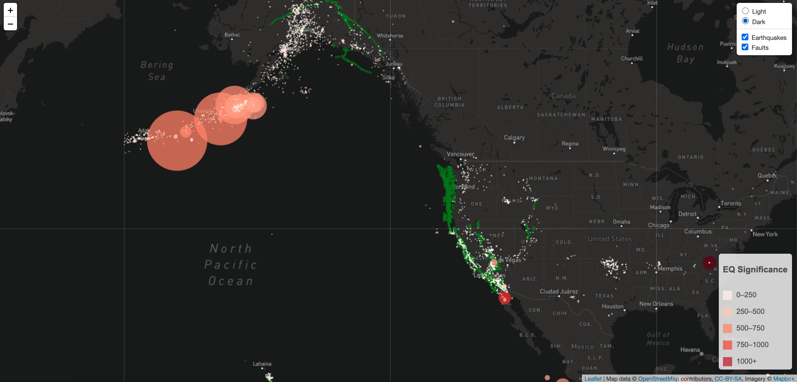

# USGS-Visualization

The objective of this project was create a visualization "leaflet map" of earthquakes and fault-lines across the world, based on the open data provided by the USGS API.

A combination of HTML, CSS, D3, Leaflet and JavaScript was used to achive the following view:

General instruction to run the code:

1. Leaflet-Step-1 folder contains the code related to only earthquakes visualization.
2. Leaflet-Step-2 folder contains the code related to earthquakes and fault-lines visualization.
3. You will need to generate a token from MapBox [MapBox](https://account.mapbox.com/access-tokens/) , and create a "config.js" file within the "js" subfolder for each step folder, in order to store the token as "API_KEY".
